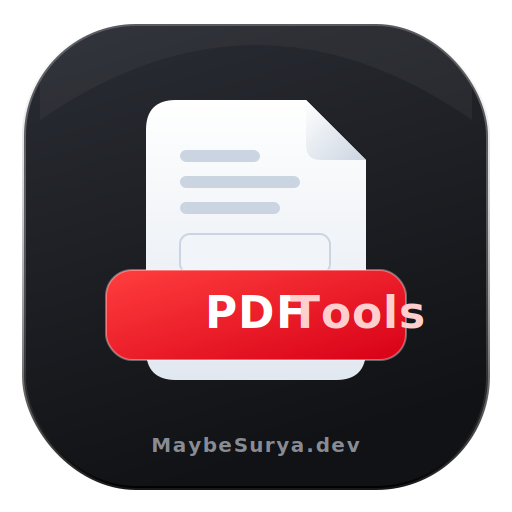

<div align="center">
  
  <h1>PDFTools</h1>
  <p><strong>A beautiful, privacy-first, 100% client-side suite of PDF utilities.</strong></p>
  <p>
    <a href="#features">Features</a> • 
    <a href="#the-toolkit">The Toolkit</a> • 
    <a href="#getting-started">Getting Started</a> • 
    <a href="#contributing">Contributing</a> • 
    <a href="#support--sponsorship">Support</a>
  </p>
</div>

---

Formerly _IMG2PDF_, **PDFTools** is a radically fast, entirely client-side web application built to solve all of your daily PDF manipulation needs. Because all processing happens directly within your browser, **your files never leave your device**, ensuring 100% privacy and security without relying on external servers.

Designed with an ultra-clean, minimal aesthetic, PDFTools offers an entire suite of applications ranging from image converters to precise metadata editors and aggressive document compressors inside a sleek installable Progressive Web App (PWA).

## 🧰 The Toolkit

PDFTools ships with **9 powerful utilities**:

1. **Image → PDF**: The classic suite. Batch crop, rotate, flip, fine-tune brightness/contrast, and organize unlimited imagery into a single customizable PDF document.
2. **Merge PDFs**: Smoothly drag, drop, reorder, and stitch multiple PDF documents together effortlessly.
3. **Extract Pages**: Type exact page numbers and ranges (e.g., `1, 3-5, 8`) to spawn a new PDF representing only what you selected.
4. **Watermark PDF**: Stamp custom text overlays diagonally or horizontally across your PDFs with precision opacity and color styling.
5. **Add Page Numbers**: Automatically enumerate every page of an unnumbered PDF using 5 different custom formats (including numerals, fractions, and Roman types).
6. **Rotate Pages**: Fix scanning mistakes smoothly by snapping pages to correct 90° rotations on documents of any size.
7. **PDF → Image**: The reverse engine. Renders every vector page of your PDF and bundles them instantly into a clean, downloadable `.ZIP` archive.
8. **Metadata Editor**: Read and securely overwrite internal structural XMP tags (Title, Author, Subject, Creator).
9. **Compress PDF**: Two intelligent modes:
   - **Quick (Lossless)**: Uses native `useObjectStreams` to serialize document properties heavily without crushing vectors.
   - **Aggressive (Flatten)**: Completely circumvents Javascript backend restrictions by silently rendering every page to an invisible canvas, creating a fully flattened document that dramatically shrinks bloated sizes.

## 🌟 Capabilities

- **100% Private**: Zero server uploads. Built purely on client-side JS + HTML5 APIs.
- **Premium UI**: Monochromatic, sleek glassmorphic dashboard inspired by modern native operating systems.
- **Installable PWA**: Install seamlessly to your iOS, Android, or desktop home screen for offline productivity.
- **Dark Mode**: Comes with a gorgeous, automatic dark mode that reacts to system preferences.
- **Framer Motion**: State-of-the-art layout transition animations across all tool-switching routing events.

## 🛠 Tech Stack

- **Framework**: [Next.js 15](https://nextjs.org/) (App Router, React 19)
- **PDF Engine**: [pdf-lib](https://pdf-lib.js.org/) (Client-side document generation/mutation)
- **Rendering**: [pdfjs-dist](https://mozilla.github.io/pdf.js/) (Advanced rendering for PDF-to-Image & Compression modes)
- **Animations**: [Framer Motion](https://www.framer.com/motion/)
- **Icons**: [Lucide React](https://lucide.dev/)
- **Styling**: Pure CSS + Custom Token Variables (No Tailwind!)

## 🚀 Getting Started

To run this project locally:

```bash
# 1. Clone the repository
git clone https://github.com/MaybeSurya/pdftools.git

# 2. Navigate to the project directory
cd pdftools

# 3. Install dependencies
npm install

# 4. Start the development server
npm run dev
```

Open [http://localhost:3000](http://localhost:3000) with your browser to explore the dashboard.

## 🤖 Notice of AI Development

This project was built primarily relying on **Agentic AI** systems acting as autonomous coding assistants. The structural logic, complex binary sequence handling, client-side rendering algorithms, UI/UX interaction flows, Framer Motion animations, and overall implementation were deeply guided or written by sophisticated AI tooling working in a continuous collaboration loop with the developer.

This codebase serves as a demonstration of high-quality, production-ready software generation using state-of-the-art AI.

## 🐛 Reporting Bugs & Features

Bug reports and feature requests are **always appreciated!**

If you encounter an issue, please use the built-in Bug Reporting tool in the bottom right corner of the application to generate an auto-structured log containing your device specifications, or use the issue tracker directly:

- [Report a Bug](https://github.com/MaybeSurya/pdftools/issues)
- [Request a Feature](https://github.com/MaybeSurya/pdftools/issues)
- Alternatively, email directly: `bugs@maybesurya.dev`

## ❤️ Support & Sponsorship

If this project has saved you time and you want to support open-source development, please consider sponsoring! It helps me dedicate more time to maintaining, improving, and creating high-quality, privacy-focused developer tools.

- **GitHub Sponsors**: [github.com/sponsors/MaybeSurya](https://github.com/sponsors/MaybeSurya)
- **RazorPay**: [razorpay.me/@devnexis](https://razorpay.me/@devnexis)

---

<div align="center">
  Built with ❤️ by <strong><a href="https://maybesurya.dev">MaybeSurya.dev</a></strong>
</div>
