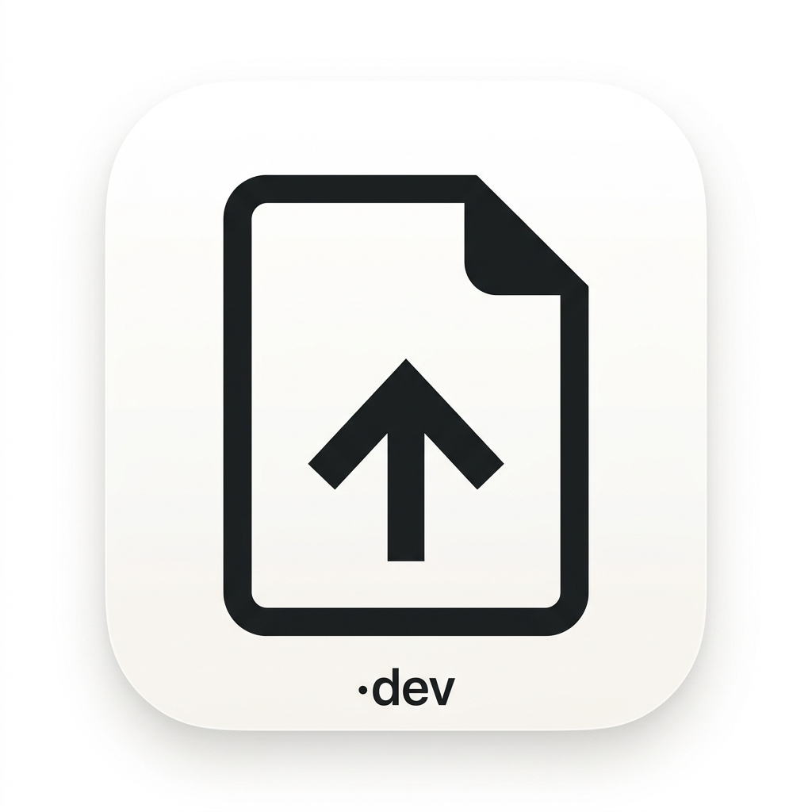

<div align="center">
  
  <h1>IMG2PDF</h1>
  <p><strong>A beautiful, privacy-first, 100% client-side Image to PDF converter.</strong></p>
  <p>
    <a href="#features">Features</a> • 
    <a href="#getting-started">Getting Started</a> • 
    <a href="#contributing">Contributing</a> • 
    <a href="#support--sponsorship">Support</a>
  </p>
</div>

---

IMG2PDF is a fast, entirely client-side web application built to convert your images (PNG, JPG, WEBP, HEIC) to beautifully formatted PDF documents. Because all processing happens directly in your browser, **your files never leave your device**, ensuring 100% privacy and security.

Designed with an ultra-clean, minimal aesthetic, IMG2PDF offers advanced image editing capabilities in a simple, installable Progressive Web App (PWA).

## 🌟 Features

- **100% Private**: Zero server uploads. Built purely on client-side JS.
- **Premium UI**: Monochromatic, glassmorphic design system heavily inspired by top-tier modern apps.
- **Batch Editing**: Crop, rotate, flip, and fine-tune brightness/contrast for multiple images at once.
- **Advanced Export Options**: Custom page sizes (A4, Letter, etc.), margins, orientations, and customizable numbered pagination styles.
- **Installable PWA**: Install seamlessly to your iOS, Android, or desktop home screen.
- **Dark Mode**: Comes with a gorgeous, automatic dark mode to protect your eyes.

## 🛠 Tech Stack

- **Framework**: [Next.js 15](https://nextjs.org/) (App Router, React 19)
- **PDF Engine**: [pdf-lib](https://pdf-lib.js.org/) (for client-side document generation)
- **Animations**: [Framer Motion](https://www.framer.com/motion/) (for silky-smooth layout transitions and toasts)
- **Icons**: [Lucide React](https://lucide.dev/)
- **Styling**: Pure CSS Modules + Custom Design Token Variables (No Tailwind!)
- **Image Processing**: Native HTML5 Canvas API

## 🚀 Getting Started

To run this project locally:

```bash
# 1. Clone the repository
git clone https://github.com/MaybeSurya/img2pdf.git

# 2. Navigate to the project directory
cd img2pdf

# 3. Install dependencies
npm install

# 4. Start the development server
npm run dev
```

Open [http://localhost:3000](http://localhost:3000) with your browser to see the result.

## 🤖 Notice of AI Development

This project was built primarily relying on **Agentic AI** systems acting as autonomous coding assistants. The structural logic, complex canvas processing algorithms, UI/UX interaction flows, Framer Motion animations, and overall implementation were deeply guided or written by sophisticated AI tooling working in a continuous collaboration loop with the developer.

This codebase serves as a demonstration of high-quality software generation using state-of-the-art AI.

## 🐛 Reporting Bugs & Features

Bug reports and feature requests are **always appreciated!**

If you encounter an issue or have an idea to make IMG2PDF better, please use the issue tracker:

- [Report a Bug](https://github.com/MaybeSurya/img2pdf/issues)
- [Request a Feature](https://github.com/MaybeSurya/img2pdf/issues)

When reporting a bug, please include your device, browser, and steps to reproduce.

## ❤️ Support & Sponsorship

If this project has saved you time and you want to support open-source development, please consider sponsoring! It helps me dedicate more time to maintaining, improving, and creating high-quality, privacy-focused developer tools.

- **GitHub Sponsors**: [github.com/sponsors/MaybeSurya](https://github.com/sponsors/MaybeSurya)
- **RazorPay**: [razorpay.me/@devnexis](https://razorpay.me/@devnexis)

---

<div align="center">
  Built with ❤️ by <strong><a href="https://maybesurya.dev">MaybeSurya.dev</a></strong>
</div>
